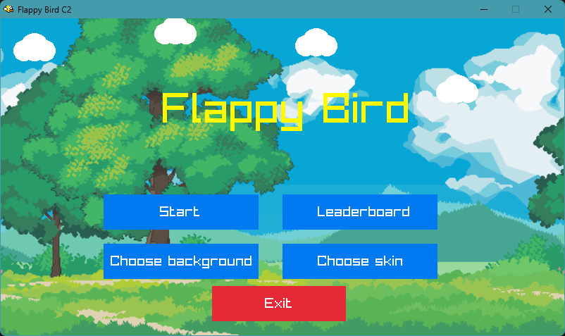
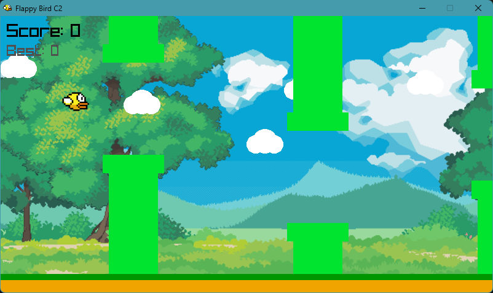

# 🐦 Flappy Bird - Proyek Pengembangan Aplikasi Berbasis Library (C2)
[](https://www.raylib.com/)
[](https://en.wikipedia.org/wiki/C_(programming_language))

## 🌟 Tentang Proyek Ini
Flappy Bird adalah game 2D berbasis pixel di mana pemain mengendalikan burung yang harus melewati rintangan berupa pipa tanpa menabraknya. Selain pipa, pemain juga harus menghindari menyentuh tanah karena akan menyebabkan game over. Game ini dibuat menggunakan bahasa C dan library Raylib untuk menangani grafik dan input dari pemain.
Proyek ini merupakan bagian dari mata kuliah Pengembangan Aplikasi Berbasis Library, Program Studi D3 - Teknik Informatika, Jurusan Teknik Komputer dan Informatika.

## 📸 Tampilan Game



## ✨ Fitur Utama
- Gameplay Flappy Bird klasik dengan kontrol sederhana.
- Gerakan burung mengikuti gravitasi dan input pemain.
- Rintangan pipa bergerak dari kanan ke kiri.
- Deteksi tabrakan burung dengan pipa atau tanah yang akurat untuk game over.
- Sistem skor dan leaderboard.
- Menu utama yang mudah digunakan.
- Tampilan layar game over yang informatif.
- Efek suara dan musik untuk pengalaman bermain lebih seru.
- Pilihan latar belakang yang dapat diubah.

## 🎮 Cara Bermain
- Tekan **SPACE BAR** untuk membuat burung terbang ke atas.
- Hindari tabrakan dengan pipa dan tanah.
- Setiap melewati sepasang pipa, skor bertambah 1.
- Game over jika burung menabrak pipa, menyentuh tanah, atau keluar layar atas.
- Tekan **P** untuk pause atau melanjutkan permainan.
- Saat game over, tekan **ENTER** untuk mulai ulang.
- Tekan **BACKSPACE** dari layar game over atau bantuan untuk kembali ke menu utama.
- Masukkan nama sebelum mulai untuk disimpan di leaderboard.


## 🚀 Instalasi dan Cara Menjalankan Game
### Cara 1
1. Unduh file game dari Github
https://github.com/zahraldila/C2-FlappyBird/releases
2. Ekstrak file Flappybird.v1.0.zip
3. Jalankan flappybird.exe
4. Tekan Spasi untuk bermain
5. Hindari tabrakan dengan pipa atau tanah untuk mencetak skor

### Cara 2
## ⚙️ Persyaratan Sistem
- Compiler C (`gcc`/`clang`)
- Make utility (`make`)
- Git (`MSYS2`, `MinGW`, atau `WSL`)
- Raylib

#### 1. Clone Repositori & Inisialisasi Submodul
1. Buka terminal (Command Prompt, PowerShell, Git Bash, atau Terminal di macOS/Linux).  
2. Clone repositori dengan perintah berikut:  
```bash
   git clone https://github.com/zahraldila/c2-flappybird.git
```
3. Masuk ke folder proyek:
```bash
cd c2-flappybird
```
4. Inisialisasi dan update submodul Raylib (dibutuhkan agar Raylib terunduh):
```bash
git submodule update --init --recursive
```

#### 2. Build Proyek
1. Buka terminal:

    Windows: bisa menggunakan Command Prompt, PowerShell, Git Bash, atau terminal di VS Code.

    Linux/macOS: Terminal.

3. Masuk ke folder proyek
Jika proyek disimpan di direktori Downloads/c2-flappybird, jalankan perintah berikut untuk masuk ke folder proyek melalui terminal:
```bash
cd Downloads/c2-flappybird
```

4. Pastikan make dan compiler C (gcc atau setara) sudah terinstal. Jalankan perintah berikut untuk membangun executable:
```bash
make build
```
Jika berhasil, file game.exe (untuk Windows) atau game (untuk Linux/macOS) akan muncul di direktori utama.

#### 3. Jalankan Game
Untuk menjalankan game:
```bash
make run
```

## 👥 Anggota Tim C2

| Nama                      | Tugas                                         | NIM         |
| :------------------------ | :-------------------------------------------- | :---------- |
| Alexandrio Vega Bonito    | Pembuatan dan Pergerakan Pipa                 | 241511067   |
| Dava Ramadhan             | Logika Burung (Gravitasi, Lompat) & Input Key | 241511070   |
| Qlio Amanda               | Integrasi Sound dan Sistem Skor               | 241511087   |
| Zahra Aldila              | Deteksi Tabrakan dan State Game               | 241511094   |
| Zakky Zhillan M.I         | Pengembangan Main Menu dan Integrasi Proyek   | 241511095   |

### Manager Proyek: Djoko Cahyo Utomo
